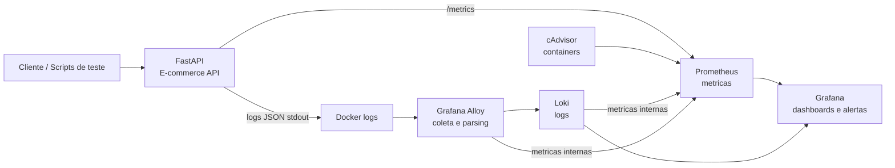
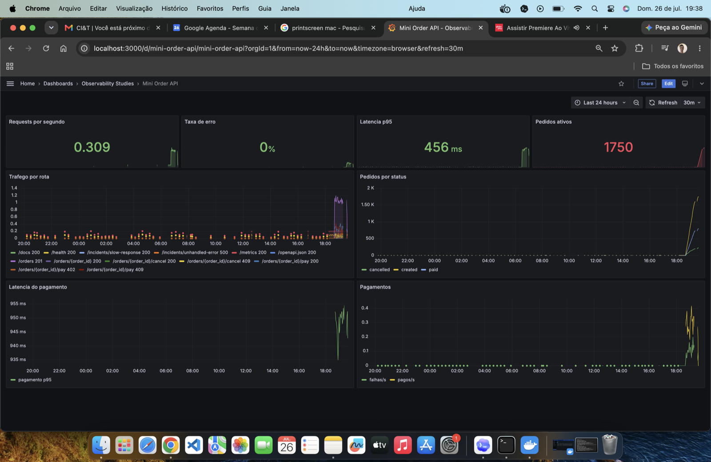
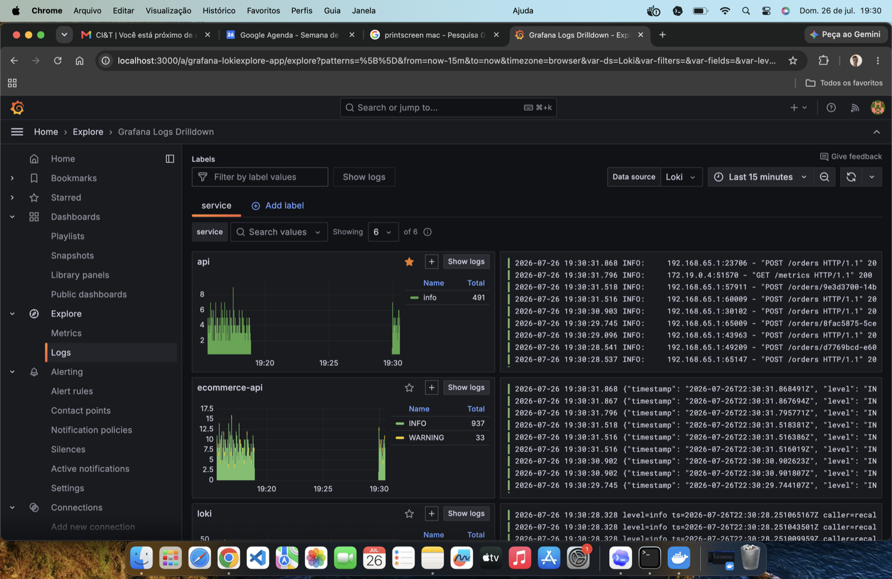
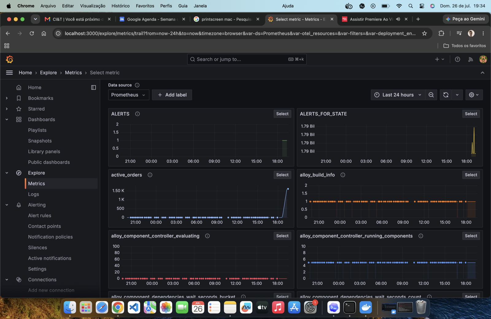

# E-commerce Observability Lab

Laboratorio local de observabilidade para praticar monitoramento, troubleshooting e analise de incidentes em uma API de e-commerce.

A aplicacao simula um fluxo simples de pedidos e pagamentos usando Python/FastAPI. O ambiente roda com Docker Compose e integra Prometheus, Grafana, Loki, Grafana Alloy e cAdvisor para aproximar o estudo de um cenario real de operacao.

## Objetivo

Este projeto foi criado para praticar:

- analise estruturada de logs em JSON;
- investigacao por `request_id` e `correlation_id`;
- metricas tecnicas e metricas de negocio;
- dashboards no Grafana;
- consultas PromQL e LogQL;
- alertas de disponibilidade, erro e latencia;
- simulacao de incidentes de pagamento, erro 500 e resposta lenta;
- operacao de aplicacoes containerizadas.

## Arquitetura



## Stack

| Componente | Papel | URL local |
| --- | --- | --- |
| FastAPI | API de pedidos e pagamentos | http://localhost:8000/docs |
| Prometheus | Coleta e consulta de metricas | http://localhost:9090 |
| Grafana | Dashboards, Explore e alertas | http://localhost:3000 |
| Loki | Armazenamento de logs | http://localhost:3100/ready |
| Grafana Alloy | Coleta logs Docker e envia ao Loki | http://localhost:12345 |
| cAdvisor | Metricas dos containers | http://localhost:8080 |

Login do Grafana:

- Usuario: `admin`
- Senha: `admin`

## Como Rodar

Suba toda a stack:

```bash
docker compose up --build -d
```

Verifique os containers:

```bash
docker compose ps
```

Resultado esperado:

```text
mini-order-api          healthy
mini-order-prometheus   healthy
mini-order-loki         healthy
mini-order-alloy        healthy
mini-order-grafana      healthy
mini-order-cadvisor     healthy
```

Execute o teste rapido:

```bash
python3 scripts/smoke_test.py
```

Resultado esperado:

```text
OK health -> HTTP 200
OK create order -> HTTP 201
OK get order -> HTTP 200
OK pay order -> HTTP 200 ou HTTP 402
OK metrics -> HTTP 200
```

## Funcionalidades da API

```http
GET /health
GET /metrics
POST /orders
GET /orders
GET /orders/{order_id}
POST /orders/{order_id}/pay
POST /orders/{order_id}/cancel
GET /incidents/slow-response
GET /incidents/unhandled-error
```

Criar pedido:

```bash
curl -X POST http://localhost:8000/orders \
  -H "Content-Type: application/json" \
  -d '{"customer_id":"customer-1","product_id":"product-1","quantity":2,"unit_price":49.90}'
```

Cada resposta inclui headers de investigacao:

```text
X-Request-ID
X-Correlation-ID
```

## Logs Estruturados

A API emite logs JSON em stdout. O Alloy coleta os logs dos containers, processa os campos principais e envia ao Loki.

Exemplo de evento:

```json
{
  "timestamp": "2026-07-20T22:31:43.851Z",
  "level": "INFO",
  "service": "ecommerce-api",
  "environment": "development",
  "event": "http_request_completed",
  "message": "HTTP request completed",
  "request_id": "75d8a4de-90ef-4bd3-a1d7-ef556fd8ce42",
  "correlation_id": "75d8a4de-90ef-4bd3-a1d7-ef556fd8ce42",
  "method": "POST",
  "route": "/orders/{order_id}/pay",
  "status_code": 402,
  "duration_ms": 184.3,
  "user_id": "anonymous",
  "order_id": "internal-order-id",
  "error_type": "PaymentDeclined",
  "error_code": "PAYMENT_DECLINED"
}
```

Labels de baixa cardinalidade no Loki:

- `service`
- `environment`
- `event`
- `level`
- `container`
- `compose_project`

IDs como `request_id`, `correlation_id` e `order_id` ficam no JSON do log, nao como labels.

## Consultas Loki

No Grafana, acesse **Explore**, selecione **Loki** e teste:

Todos os logs da API:

```logql
{service="ecommerce-api"}
```

Falhas de pagamento:

```logql
{service="ecommerce-api", event="payment_failed"}
```

Erros inesperados:

```logql
{service="ecommerce-api", event="unhandled_exception"}
```

Investigar uma requisicao por `request_id`:

```logql
{service="ecommerce-api"} | json | request_id="COLE_O_REQUEST_ID"
```

Investigar um pedido por `order_id`:

```logql
{service="ecommerce-api"} | json | order_id="COLE_O_ORDER_ID"
```

Requisicoes com erro:

```logql
{service="ecommerce-api", event="http_request_completed"} | json | status_code >= 400
```

## Metricas Prometheus

A API expoe metricas em:

```text
http://localhost:8000/metrics
```

Principais metricas:

| Metrica | Uso |
| --- | --- |
| `ecommerce_http_requests_total` | Volume de requisicoes por metodo, rota e status |
| `ecommerce_http_request_duration_seconds` | Latencia por metodo, rota e status |
| `ecommerce_application_errors_total` | Erros por tipo e rota |
| `ecommerce_orders_total` | Pedidos por status |
| `ecommerce_payments_total` | Pagamentos por status e provedor |
| `ecommerce_external_request_duration_seconds` | Latencia da dependencia externa simulada |
| `ecommerce_external_request_errors_total` | Erros da dependencia externa simulada |
| `ecommerce_application_info` | Versao e ambiente da aplicacao |

Consultas uteis:

```promql
sum(rate(ecommerce_http_requests_total[1m]))
```

```promql
sum(rate(ecommerce_http_requests_total{status_code=~"4..|5.."}[5m]))
/
sum(rate(ecommerce_http_requests_total[5m]))
```

```promql
histogram_quantile(
  0.95,
  sum(rate(ecommerce_http_request_duration_seconds_bucket[5m])) by (le)
)
```

```promql
increase(ecommerce_payments_total{status="failed"}[5m])
```

## Prints Esperados

Ao usar o projeto, estes sao os prints que fazem sentido para documentar seu portfolio:

1. **Docker Compose**
   - Tela do terminal com `docker compose ps`.
   - Todos os servicos devem aparecer como `healthy`.

2. **Prometheus Targets**
   - URL: http://localhost:9090/targets
   - Esperado: jobs `ecommerce-api`, `prometheus`, `loki`, `alloy` e `cadvisor` como `UP`.

3. **Grafana Dashboard**
   - URL: http://localhost:3000
   - Dashboard: `Mini Order API`
   - Esperado: graficos de requests por segundo, taxa de erro, latencia p95, pedidos ativos, trafego por rota, pedidos por status e pagamentos.

4. **Grafana Explore com Loki**
   - Datasource: `Loki`
   - Query:
     ```logql
     {service="ecommerce-api", event="payment_failed"}
     ```
   - Esperado: logs JSON de falhas de pagamento com `request_id`, `order_id`, `transaction_id` e `error_code`.

5. **Investigacao por Request ID**
   - Copie um `X-Request-ID` de uma resposta ou log.
   - Query:
     ```logql
     {service="ecommerce-api"} | json | request_id="COLE_O_REQUEST_ID"
     ```
   - Esperado: fluxo completo da requisicao.

## Evidencias Visuais

### Grafana Mini Order API Dashboard



Esta tela mostra o dashboard principal do laboratorio com indicadores de requests por segundo, taxa de erro, latencia p95, pedidos ativos, trafego por rota, pedidos por status, latencia de pagamento e pagamentos aprovados/falhos. Ela e a principal evidencia visual de que a API esta emitindo metricas de negocio e de plataforma para o Prometheus e que o Grafana consegue transformar esses dados em uma visao operacional.

### Grafana Loki Logs Drilldown



Esta tela demonstra que o Grafana esta conectado ao Loki e consegue agrupar logs por labels como `service`. No exemplo, aparecem logs da API `ecommerce-api`, incluindo eventos em JSON com niveis `INFO` e `WARNING`, o que permite investigar falhas de pagamento, erros HTTP e fluxos especificos por `request_id`.

### Grafana Prometheus Metrics Explore



Esta tela demonstra o lado de metricas do laboratorio. O Grafana esta usando o datasource `Prometheus` e lista series como `active_orders`, `ALERTS` e metricas internas do Alloy. Isso evidencia que a stack coleta metricas da aplicacao e dos componentes de observabilidade, permitindo correlacionar graficos de saude com logs no Loki.

## Simular Trafego

Gerar pedidos e pagamentos continuamente:

```bash
python3 scripts/generate_traffic.py
```

Esse script cria pedidos, tenta pagar e cancela alguns pedidos. A rota de pagamento tem atraso e falha aleatoria configuravel por ambiente:

```yaml
PAYMENT_FAILURE_RATE: "0.25"
PAYMENT_MIN_DELAY_MS: "80"
PAYMENT_MAX_DELAY_MS: "900"
```

## Simular Incidentes

Falhas de pagamento:

```bash
python3 scripts/incident_scenarios.py payment-failures
```

Latencia alta:

```bash
python3 scripts/incident_scenarios.py slow-response
```

Erro inesperado HTTP 500:

```bash
python3 scripts/incident_scenarios.py unhandled-error
```

Mais detalhes em [INCIDENT_PLAYBOOK.md](INCIDENT_PLAYBOOK.md).

## Roteiro de Troubleshooting

1. **Detectar o sintoma**
   - Verifique o dashboard no Grafana.
   - Observe taxa de erro, latencia p95 e falhas de pagamento.

2. **Confirmar com metricas**
   - Use Prometheus para validar se o problema e pontual ou recorrente.
   - Consulte `ecommerce_http_requests_total`, `ecommerce_application_errors_total` e `ecommerce_payments_total`.

3. **Encontrar logs relacionados**
   - Abra Grafana Explore.
   - Use Loki com `{service="ecommerce-api"}`.
   - Filtre por `event`, `request_id` ou `order_id`.

4. **Correlacionar evento e metrica**
   - Compare o horario do pico de erro no Grafana com os logs do mesmo periodo.
   - Procure `payment_failed`, `unhandled_exception` ou `incident_slow_response_simulated`.

5. **Registrar causa provavel**
   - Exemplo: aumento de falhas do provedor ficticio de pagamento.
   - Evidencias: metrica `ecommerce_payments_total{status="failed"}` e logs `payment_failed`.

6. **Validar recuperacao**
   - Rode novamente o smoke test.
   - Confirme se os targets do Prometheus estao `UP`.
   - Confirme se novos logs chegam ao Loki.

## Alertas

As regras Prometheus estao versionadas em:

```text
observability/prometheus/rules.yml
```

Alertas incluidos:

- `EcommerceApiDown`
- `EcommerceHighErrorRate`
- `EcommerceHighLatencyP95`
- `EcommercePaymentFailures`

## Estrutura do Projeto

```text
.
|-- app/
|   `-- main.py
|-- observability/
|   |-- alloy/
|   |-- grafana/
|   |-- loki/
|   `-- prometheus/
|-- scripts/
|   |-- generate_traffic.py
|   |-- incident_scenarios.py
|   `-- smoke_test.py
|-- docker-compose.yml
|-- Dockerfile
|-- INCIDENT_PLAYBOOK.md
|-- OBSERVABILITY_DIAGNOSTIC.md
|-- README.md
`-- requirements.txt
```

## Rodar Apenas a API

```bash
python3 -m venv .venv
source .venv/bin/activate
pip install -r requirements.txt
uvicorn app.main:app --reload
```

## Proximas Evolucoes

- Adicionar PostgreSQL para persistir pedidos.
- Criar dashboards separados para logs, infraestrutura e incidentes.
- Provisionar alertas do Grafana com contact points.
- Adicionar tracing distribuido com OpenTelemetry e Grafana Tempo.
- Criar um worker com fila para simular processamento assincrono.
